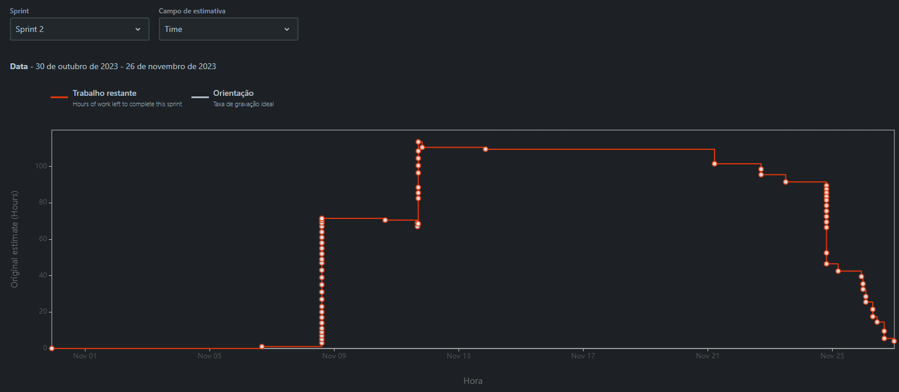

# Projeto Integrador do primeiro semestre do ano letivo 2023-2024 na LEI-ISEP #

Este é o modelo do projeto para o primeiro semestre do segundo ano do LEI [(Licenciatura em Engenharia Informática)](http://www.isep.ipp.pt/Course/Course/26) em 2023/2024.

Contém artefatos didáticos relevantes para o projeto integrativo a ser desenvolvido durante o primeiro semestre do ano acadêmico de 2023-2024 no curso de Engenharia Informática do [Instituto Superior de Engenharia do Porto (ISEP)](http://www.isep.ipp.pt).


## Organização do projeto 


Este projeto utiliza Java e o Maven.

Para configurar o Maven para executar testes, é necessário declarar o plugin "maven-surefire-plugin" no arquivo "pom.xml" e configurar suas dependências. Para este propósito, são necessárias as seguintes dependências:
* Apache POI
    - https://mvnrepository.com/artifact/org.apache.poi/poi
        - necessário para trabalhar com ficheiros .xlsx
 

### Codigos Maven 

#### Compila o codigo
```
mvn clean package
```
#### Executa o codigo
```
mvn exec:java
```
### Verificar a cobertura dos testes
```
mvn clean verify
```
### Executar o programa final (.JAR)
```
cd target
```
```
java -jar lapr3-project-1.0.0-jar-with-dependecies.jar
```

## Executar o programa de arqcp (C)
```
cd src/main/arqcp/sprint3/main
```
```
make run
```

## Lista de conteúdos 

* [Artefactos globais](./docs/global-artifacts/readme.md)
* [Diagramas BDDAD](./docs/bddad/models/Diagrams.md)
* [Estrutura do Armazém (fsiap)](docs/fsiap/readme.md)

## Burndown Chart



## Elementos do grupo 


| Número de estudante | Nome            |
|---------------------|-----------------|
| **1221694**         | João Pinto      |
| **1220612**         | José Sá         | 
| **1211883**         | Mariana Correia |          
| **1201804**         | Rafael Araújo   |
| **1221700**         | Vasco Sousa     |
