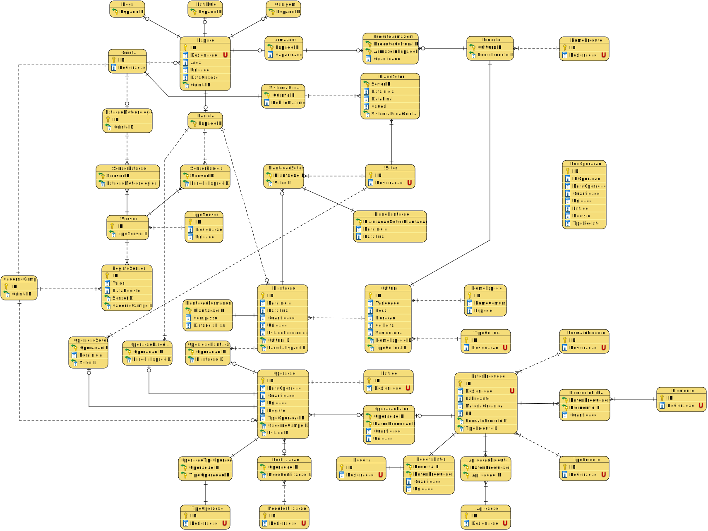
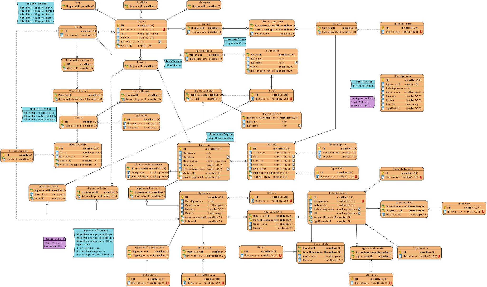

# 1. Diagramas

## Modelo Conceptual

## Modelo Lógico

## Modelo Físico

## Informação Adicional

 - A função **__"CHECK(CAPACIDADE > 0)"__**
    garante que os valores na coluna "CAPACIDADE" só podem ser superiores a zero.
    Isso impede a inserção de outros valores, garantindo a consistência dos dados na base de dados.

 - A função **__"CHECK(QUANTIDADE > 0)"__**
    garante que os valores na coluna "QUANTIDADE" só podem ser superiores a zero.
    Isso impede a inserção de outros valores, garantindo a consistência dos dados na base de dados.

 - A função **__"CHECK(AREA > 0)"__**
    garante que os valores na coluna "AREA" só podem ser superiores a zero.
    Isso impede a inserção de outros valores, garantindo a consistência dos dados na base de dados.

 - A função "**__CHECK(QUANTIDADE > 0 AND QUANTIDADE <= 100)__**"
    garante que os valores na coluna "QUANTIDADE" só podem ser superiores a zero e inferiores ou iguais a 100.
    Isso impede a inserção de outros valores, garantindo a consistência dos dados na base de dados.

 - A função "**__CHECK(MATERIAORGANICA >= 0 AND MATERIAORGANICA <= 100)__**"
    garante que os valores na coluna "MATERIAORGANICA" só podem ser iguais ou superiores a 0 e inferiores ou iguais a 100.
    Isso impede a inserção de outros valores, garantindo a consistência dos dados na base de dados.

-  A função "**__CHECK(PH >= 0 AND PH <= 14)__**"
    garante que os valores na coluna "PH" só podem ser iguais ou superiores a 0 e inferiores ou iguais a 14.
    Isso impede a inserção de outros valores, garantindo a consistência dos dados na base de dados.

 - A função **__"CHECK(DURACAO > 0)"__**
    garante que os valores na coluna "DURACAO" só podem ser superiores a zero.
    Isso impede a inserção de outros valores, garantindo a consistência dos dados na base de dados.

 - A função **__"CHECK(CAUDAL > 0)"__**
    garante que os valores na coluna "CAUDAL" só podem ser superiores a zero.
    Isso impede a inserção de outros valores, garantindo a consistência dos dados na base de dados.

 - A função **__"CHECK(PERIODICIDADE IN ('P', 'I', 'T'))"__**
    garante que os valores na coluna "PERIODICIDADE" só possam ser 'P', 'I' ou 'T'.
    Isso impede a inserção de outros valores, garantindo a consistência dos dados na base de dados.

 - A função **__"CHECK (DATAINICIAL <= DATAFINAL)"__**
    garante que os valores da coluna "DATAFINAL" sejam sempre superiores ou iguais aos valores de coluna "DATAINICIAL".
    Isso impede a inserção de outros valores, garantindo a consistência dos dados na base de dados.

 - A função **__"CHECK(QUANTIDADE >= 0)"__**
    garante que os valores na coluna "QUANTIDADE" só podem ser superiores ou iguais a zero.
    Isso impede a inserção de outros valores, garantindo a consistência dos dados na base de dados.
    
 - A função **__"CHECK(DEBITOMAXIMO > 0)"__*
    garante que os valores na coluna "DEBITOMAXIMO" só podem ser superiores a zero.
    Isso impede a inserção de outros valores, garantindo a consistência dos dados na base de dados.

 - A função **__"CHECK(DESIGNACAO IN ('Permanente', 'Temporária'))"__**
    garante que os valores na coluna "DESIGNACAO" só podem ser "Permanente" ou "Temporária".
    Isso impede a inserção de outros valores, garantindo a consistência dos dados na base de dados.

