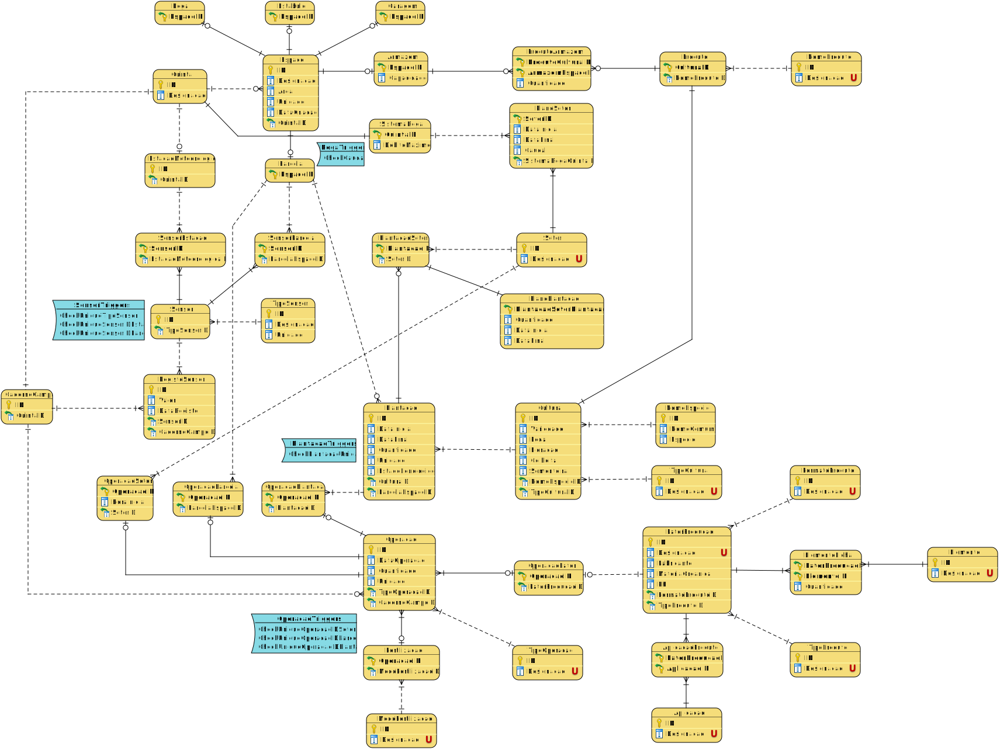

# 1. Diagramas

## Modelo Conceptual

## Modelo Lógico

## Modelo Físico

## Informação Adicional

 - A função **__"CHECK(DESIGNACAO IN ('Permanente', 'Temporária'))"__** 
    garante que os valores na coluna "DESIGNACAO" só podem ser "Permanente" ou "Temporária".
    Isso impede a inserção de outros valores, garantindo a consistência dos dados na base de dados.

